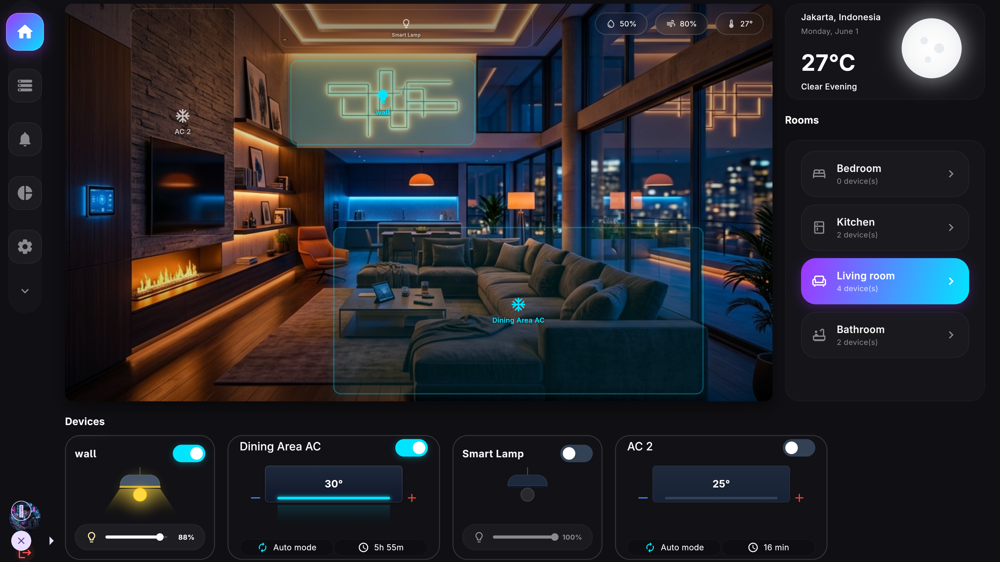

# 🏠 Smart Home IoT

<p align="center">
  <strong>A professional Flutter application for real-time monitoring and control of a smart home network.</strong>
  <br />
  The app acts as a unified control panel that bridges a mobile/desktop interface to physical IoT hardware, supporting two distinct communication protocols: a custom ESP32 HTTP API and the open Matter standard via Google Home integration.
</p>

<p align="center">
  <a href="https://github.com/abod8639/smart_home/actions/workflows/flutter_ci.yml"></a>
  <a href="https://codecov.io/gh/abod8639/smart_home"></a>
  <a href="https://flutter.dev"></a>
  <a href="https://dart.dev"></a>
</p>

<p align="center">
  
  <a href="https://pub.dev/packages/flutter_riverpod"></a>
  <a href="https://pub.dev/packages/hive"></a>
</p>

<p align="center">
  <a href="#matter-protocol-integration"></a>
  <a href="#hardware-communication-layer"></a>
  <a href="#data-persistence"></a>
</p>

---

## Purpose

The application is designed for homeowners and developers who have built or are building a DIY smart home using ESP32 microcontrollers as the central hub. It solves the problem of fragmented device management by providing a single, visually rich interface to:

- Control all smart devices (lamps, air conditioners, RGB strips, door locks, robot vacuums) from one place.
- Program and replay infrared remote signals for any AC unit or IR-compatible device, eliminating the need for physical remotes.
- Visualize the physical layout of all devices on a room floor plan.
- Monitor real-time environmental data (temperature, humidity, airflow, power usage) polled from the ESP32 hub.
- Add new certified Matter devices directly through the Google Home commissioning flow.

---

## DEMO
Dashboard


<div align="center">
  <table>
    <tr>
      <!-- <td align="center" width="33%">
        <b>Dashboard & Live Weather</b><br/>
        
      </td> -->
      <td align="center" width="33%">
        <b>Interactive Floor Plan</b><br/>
        
      </td>
      <td align="center" width="33%">
        <b>Advanced IR Control</b><br/>
        
      </td>
    </tr>
  </table>
</div>

## How It Works

### Hardware Communication Layer

The application communicates with an ESP32 microcontroller hub using MQTT protocol (via the `mqtt_client` package) and integrates a Firebase Realtime Database fallback for external network synchronisation when MQTT is unavailable. The MQTT broker address (or IP) is configured in the Settings screen and stored persistently in `SharedPreferences`.

All hardware commands are dispatched through `Esp32Service`, a Riverpod provider (`@Riverpod(keepAlive: true)`). The service supports the following operations (both via MQTT topics and Firebase fallback commands):

- **Digital Output**: Toggles GPIO relay channels (action `set_relay` with pin and value 0/1).
- **Analog / PWM Output**: Writes PWM duty cycle values (0-255) (action `set_pwm` with pin and value).
- **IR Learn**: Puts the ESP32 IR receiver into learning mode for up to 12 seconds, captures the incoming signal, and returns a structured `IrCodeEntity` payload.
- **IR Send**: Transmits a previously learned IR code through the ESP32 IR LED transmitter (action `ir_send` with protocol, value, bits, and frequency).
- **Sensor Data / States**: Listens to sensor telemetry (`smarthome/esp32_smart_home_1/sensor` or Firebase database streams) for temperature, humidity, etc.
- **Ping**: Verifies connection status or checks Firebase online status (status `online`).

### Matter Protocol Integration

For devices certified under the Matter standard (Thread, Wi-Fi, or BLE commissioning), the app integrates with Google Home's CHIP Device Controller via the `flutter_matter` library. The `MatterService` handles:

- **Commissioning**: Pairs a new Matter device using a setup PIN code and registers it on the local fabric.
- **OnOff Cluster** (Cluster 0x0006): Toggles device power.
- **LevelControl Cluster** (Cluster 0x0008): Sets brightness via the `MoveToLevel` command.
- **ColorControl Cluster** (Cluster 0x0300): Sets RGB color by converting the input RGB values to HSV and sending a `MoveToHueAndSaturation` command.

### IR Remote Control System

The IR control system is one of the most advanced features in the application. For AC units and other IR-controlled devices, the user can record signals directly from their physical remote by pointing it at the ESP32 IR receiver. Each button (Power, Temp Up, Temp Down, Auto, Cool, Heat, Eco) is stored as a separate JSON-encoded `IrCodeEntity` in the device record.

The system supports the following IR protocols: NEC, Samsung, Sony, LG, Panasonic, Denon, Sharp, JVC, RC5, RC6, PulseDistance, PulseWidth, and RAW formats. Stored codes are validated via a round-trip integrity check before being saved to disk.

When the temperature is adjusted on the dashboard, the app automatically sends the Temp Up or Temp Down signal the required number of times in rapid succession (220 ms intervals) to match the target delta.

A local mutex (`_irBusy`) in the dashboard controller ensures only one IR command is in flight at a time, preventing signal collisions on the ESP32.

### Data Persistence

All device state and room configuration is stored locally on the device using Hive, a fast key-value NoSQL database. On first launch, the app seeds a set of mock devices. On subsequent launches, the persisted state is loaded directly from Hive, preserving all user modifications including IR codes, device positions, brightness levels, and room assignments.

### Live Weather Integration

The dashboard displays live weather data fetched from two external APIs:

1. **ipapi.co**: Determines the user's city, country, latitude, and longitude based on IP geolocation.
2. **Open-Meteo**: A free, open-source weather API that returns current temperature and a WMO weather condition code.

The app maps WMO codes to human-readable conditions and generates a contextual smart home suggestion based on the current temperature and weather pattern.

### Room Floor Plan

The Room Placement screen displays a room background image with interactive draggable markers representing each device. Markers are positioned using normalized coordinates (0.0 to 1.0) relative to the image dimensions, making them resolution-independent. Users can long-press and drag any marker to reassign a device's position. The full device property panel is accessible from this screen, including IR recording controls.

---

## Architecture

The project follows Flutter Clean Architecture principles with strict separation of concerns across three layers per feature:

```
lib/
  core/
    router/         # GoRouter named routes and branch navigation
    services/       # Esp32Service (MQTT), MatterService, HiveService, FirebaseService, NotificationService
    theme/          # AppTheme (dark palette, typography)
    utils/          # Responsive, formatting and helper utilities
    widgets/        # Shared UI components (GlassContainer, UnderConstructionView)
  features/
    auth/           # Authentication state, login and logout screens
    dashboard/      # Shell route layouts, climate status, device dashboard grids
    device/         # Device domain entities, state controllers and IR controls
    environment/    # Climate metrics providers and charts
    room/           # Room models, interactive floor plan canvas, placement widgets
    settings/       # System configurations, MQTT connection settings, Google fabric integration
    weather/        # Live weather status providers, open-meteo integration
```

**State Management**: Riverpod (`flutter_riverpod` and `@riverpod` code generation) is used for reactive state, dependency injection, and UI binding. Controllers (such as `DashboardController`) are declared as state notifier providers that update UI widgets reactively.

**Routing**: GoRouter handles named routing and nested shell layouts (using `StatefulShellRoute` for state preservation of the dashboard, settings, and other primary screens).

**Responsiveness**: A `Responsive` utility class defines three breakpoints (mobile: < 600px, tablet: < 1100px, desktop: >= 1100px). All layout widgets query this utility to adapt padding, spacing, font sizes, and column arrangements at runtime.

---

## Technology Stack

| Category | Technology |
|---|---|
| Framework | Flutter (Dart SDK >= 3.12) |
| State Management | Riverpod (with `@riverpod` generation) |
| Router | GoRouter (with branch-based navigation) |
| Hardware Communication | MQTT (mqtt_client 10.4) & Firebase Realtime Database |
| REST API Client | Dio 5.9 (used for Weather & Location API requests) |
| Matter Protocol | flutter_matter (custom local library wrapping CHIP SDK) |
| Local Storage | Hive 2.2 + Hive Flutter |
| User Preferences | SharedPreferences 2.5 |
| Geolocation | ipapi.co (IP-based, no permission required) |
| Weather Data | Open-Meteo API (open-source, no API key) |
| IR Protocol | IRremote (on ESP32 firmware side) |
| Image Picker | image_picker 1.1 (room photo selection) |
| Equality Checks | Equatable 2.0 (immutable entity comparisons) |
| Animations | Lottie 3.3 |
| Design System | Material 3 dark theme, Glassmorphism (BackdropFilter) |
| Architecture Pattern | Clean Architecture + Repository Pattern |

---

## Hardware Requirements

The application is designed to work with an ESP32 microcontroller flashed with firmware that communicates via an MQTT Broker (local or remote) or Firebase Realtime Database.

> [!NOTE]
> A companion repository containing the compatible ESP-IDF firmware for the ESP32 microcontroller is available at [smart_home_IoT_idf](https://github.com/abod8639/smart_home_IoT_idf).

The ESP32 should publish/subscribe to the following topics:

| Topic | Mode | Description | Payload Schema / Values |
|---|---|---|---|
| `smarthome/<device_id>/cmd` | Sub | Command inputs from app | `{'action': 'set_relay'/'set_pwm'/'ir_learn'/'ir_send'/'control_ac'/'set_ac_timer', ...}` |
| `smarthome/<device_id>/state` | Pub | Status/Relay/PWM updates | JSON representation of current relay & PWM levels |
| `smarthome/<device_id>/sensor` | Pub | Temperature/Humidity metrics | JSON telemetry readings |
| `smarthome/<device_id>/status` | Pub | LWT online/offline status | `'online'` or `'offline'` |

The MQTT Broker address/IP is configurable from the Settings screen. When MQTT is unavailable, the ESP32 and app fallback to synchronising command status and sensor metrics via **Firebase Realtime Database** paths (`devices/<device_id>/commands`, `devices/<device_id>/status`, etc.).

---

## Getting Started

1. Set up an MQTT Broker (e.g., Mosquitto, EMQX, or a cloud-hosted broker).
2. Configure and flash your ESP32 with compatible firmware (available in the companion [smart_home_IoT_idf](https://github.com/abod8639/smart_home_IoT_idf) repository) that connects to your MQTT Broker and/or Firebase Realtime Database.
3. Add a `.env` file to the root of the project with your Firebase Database URL if you want fallback support:
   ```env
   FIREBASE_DATABASE_URL=https://<your-project-id>.firebaseio.com
   ```
4. Clone the repository and run:
   ```bash
   flutter pub get
   flutter run
   ```
5. Open Settings in the app, enter the MQTT Broker address/IP, and verify the connection status indicator turns green.
6. Use the Room Placement screen to assign physical positions to your devices on the floor plan.
7. For AC units, open the device settings panel and record IR signals for each control button using the physical remote.
